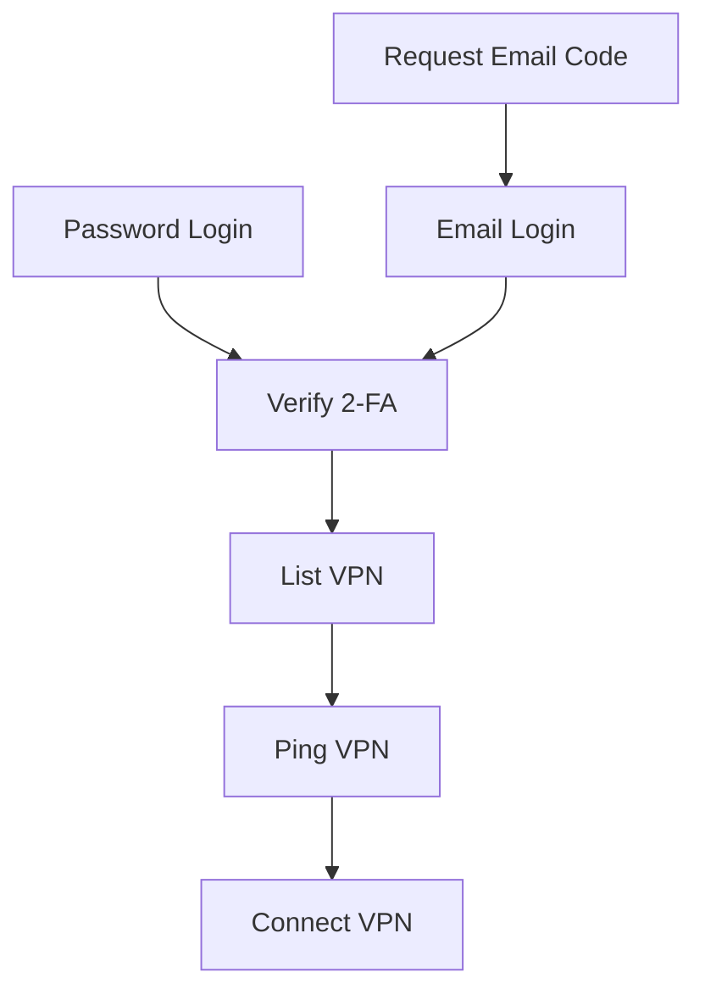
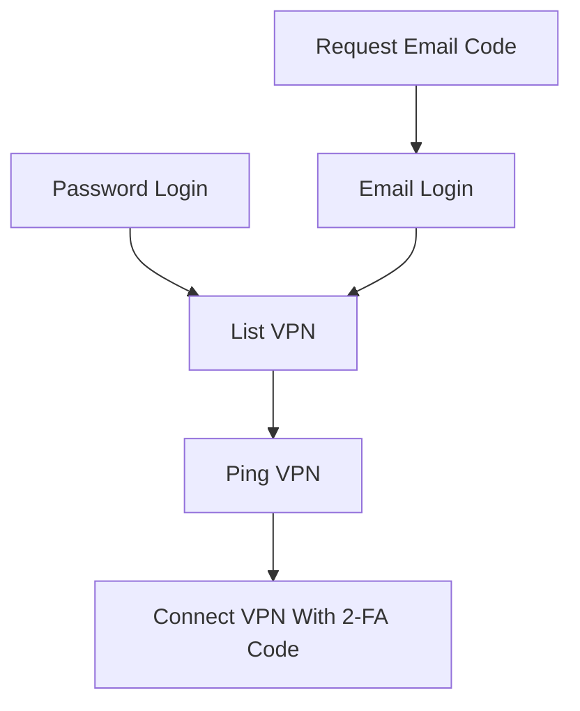

# corplink-rs

使用 rust 实现的 [飞连][1] 客户端，支持 Linux/Windows10/MacOS

# 安装

## ArchLinux

下载 [release](https://github.com/PinkD/corplink-rs/releases) 中的安装包，并安装

```bash
pacman -U corplink-rs-3.2-1-x86_64.pkg.tar.zst
```

> 欢迎贡献其它包管理器的打包脚本

## 手动编译


```bash
git clone https://github.com/PinkD/corplink-rs --depth 1
cd corplink-rs
cargo build --release
# install corplink-rs to your PATH
mv target/release/corplink-rs /usr/bin/
cd ..
git clone https://github.com/PinkD/wireguard-go --depth 1
cd wireguard-go
# you can build with `go build` on windows maunally
make
# install wg-corplink to your PATH
# your can also install it to somewhere else and use wg_binary config to tell corplink-rs where it is
mv wireguard-go /usr/bin/wg-corplink
```

# 用法

> **该程序需要 root 权限来启动 `wg-go` (windows 上需要管理员权限)**

```bash
# direct
corplink-rs config.json
# systemd
# config is /etc/corplink/config.json
systemctl start corplink-rs.service
# auto start
systemctl enable corplink-rs.service

# systemd with custom config
# config is /etc/corplink/test.json
# NOTE: cookies.json is reserved by cookie storage
systemctl start corplink-rs@test.service
```

## windows 特殊说明

windows 中启动 `wg-go` 需要 [wintun](6) 支持，请到官网下载，并将 `wintun.dll` 与 `wg-go` 放到同一目录下(或者环境变量下)

windows 中 `wg-go` 默认使用的 pipe 来实现 ipc ，但是我发现权限有问题，所以改成了 [Windows AF_UNIX](7)

## macos 特殊说明

macos 要求 tun 设备的名称满足正则表达式 `utun[0-9]*` ，因此需要将配置文件中的 `interface_name` 改为符合正则的名字，例如 `utun114514`

# 配置文件实例

最小配置

```json
{
  "company_name": "company code name",
  "username": "your_name"
}
```

推荐配置(自用配置)

```json
{
  "company_name": "company code name",
  "username": "your_name",
  "password": "your_pass",
  "platform": "ldap"
}
```

完整配置

```json
{
  "company_name": "company code name",
  "username": "your_name",
  // support sha256sum hashed pass if you don't use ldap, will ask email for code if not provided
  "password": "your_pass",
  // default is feilian, can be feilian/ldap/lark(aka feishu)
  // dingtalk/aad/weixin is not supported yet
  "platform": "ldap",
  "code": "totp code",
  // default is DollarOS(not CentOS)
  "device_name": "any string to describe your device",
  "device_id": "md5 of device_name or any string with same format",
  "public_key": "wg public key, can be generated from private key",
  "private_key": "wg private key",
  "server": "server link",
  // enable wg-go log to debug uapi problems
  "debug_wg": true,
  // will use corplink as interface name
  "interface_name": "corplink",
  // will use wg-corplink as wireguard-go
  "wg_binary": "wg-corplink",
  // will use the specified server to connect, for example 'HK-1'
  // name from server list
  "vpn_server_name": "hk"
}
```

# 原理和分析

[飞连][1] 是基于 [wg-go][2] 魔改的企业级 VPN 产品

## 配置原理

魔改了配置的方式，加了鉴权

猜测是：
- 动态管理 peer
- 客户端通过验证后，使用 public key 来请求连接，然后服务端就将客户端的 key 加到 peer 库里，然后将配置返回给客户端，等待客户端连接
    - wg 是支持同一个接口上连多个 peer ，所以这样是 OK 的
- 定时将不活跃的客户端清理，释放分配的 IP
- ...

因此，我们只需要生成 wg 的 key ，然后去找服务端拿配置，然后写到 wg 配置里，启动 wg ，就能连上服务端了

### 后续改动

2.0.9 版本(或者更早)新增了 `protocol_version` 字段，需要使用魔改后的 [wg-corplink][5] 才能连接

## 请求流程


### Linux



### Android



## otp 实现

飞连的 otp 是使用的标准的 [totp][1] ，在 ua 为 Android 时，会在登录时返回 totp 的 token ，然后使用 totp 算法就能生成出当前时间的验证码了，然后在获取连接信息时传输该验证码，就不需要单独验证验证码了

# TODO

- [ ] 使用 [Tauri][8] 实现界面(~~或许大概可能永远不会有~~)
- [ ] 实现 TCP 版的 wg 协议
- [x] 为不同配置生成不同的 `cookies.json`
- [x] windows/mac 实现
- [x] 自动使用从服务器返回的请求中的时间戳同步时间
- [x] 自动生成 wg key
- [x] 修复服务端异常断开连接后客户端不会退出的问题

# Changelog

- 0.3.6
  - fix wg-corplink not exit(by @LionheartLann)
  - fix session is expired(by @XYenon)
- 0.3.5
  - fix empty login method list
  - fix write long data to uapi(by @nolouch)
  - add vpn server name option(by @nolouch)
- 0.3.4
  - fix cookie out of date
- 0.3.3
  - add feishu tps login support
  - upgrade dependency
- 0.3.2
  - separate `cookies.json`
  - add debug flag for wg-go
- 0.3.1
  - fix mac support(on [wg-corplink][5])
- 0.3.0
  - add windows/mac support
- 0.2.3
  - fix empty `protocol_version`
  - add privilege check
- 0.2.2
  - fix wg-corplink not exit if corplink-rs exit accidently
- 0.2.1
  - use modified wireguard-go
    - don't generate config anymore
  - remove `conf_name/conf_dir` and add `interface_name/wg_binary` in config
- 0.1.4
  - get company name from company code automatically
  - support ldap
  - check and skip tcp wg server
  - optimize config
- 0.1.3
  - disconnect if wireguard handshake timeout
- 0.1.2
  - support time correction for totp
- 0.1.1
  - support generate wg key
- 0.1.0
  - first version

# 参考链接

- [wg-go][2]
- [totp][3]
- [python 版本][4]
- [wg-corplink][5]
- [wintun][6]
- [Windows AF_UNIX][7]
- [Tauri][8]

# License

```license
 Copyright (C) 2023  PinkD, ShuNing, LionheartLann, XYenon

    This program is free software; you can redistribute it and/or
    modify it under the terms of the GNU General Public License
    as published by the Free Software Foundation; either version 2
    of the License, or (at your option) any later version.

    This program is distributed in the hope that it will be useful,
    but WITHOUT ANY WARRANTY; without even the implied warranty of
    MERCHANTABILITY or FITNESS FOR A PARTICULAR PURPOSE.  See the
    GNU General Public License for more details.

    You should have received a copy of the GNU General Public License
    along with this program; if not, write to the Free Software
    Foundation, Inc., 51 Franklin Street, Fifth Floor, Boston, MA  02110-1301, USA.
```


[1]: https://www.volcengine.com/product/vecorplink
[2]: https://github.com/WireGuard/wireguard-go
[3]: https://en.wikipedia.org/wiki/Time-based_one-time_password
[4]: https://github.com/PinkD/corplink
[5]: https://github.com/PinkD/wireguard-go
[6]: https://www.wintun.net/
[7]: https://devblogs.microsoft.com/commandline/af_unix-comes-to-windows/
[8]: https://github.com/tauri-apps/tauri
