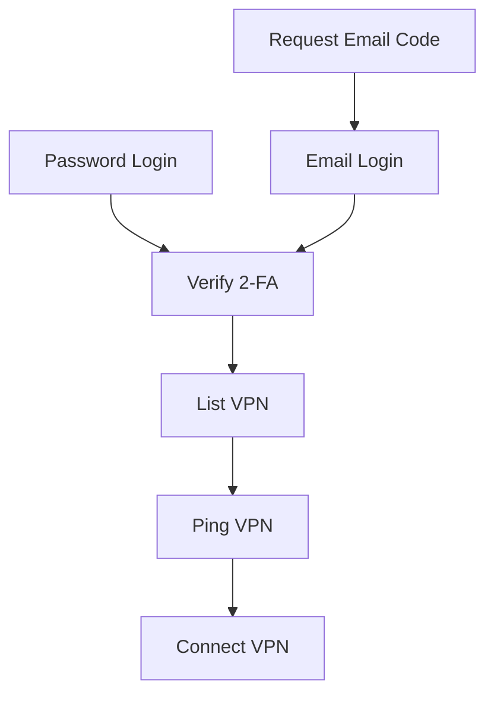
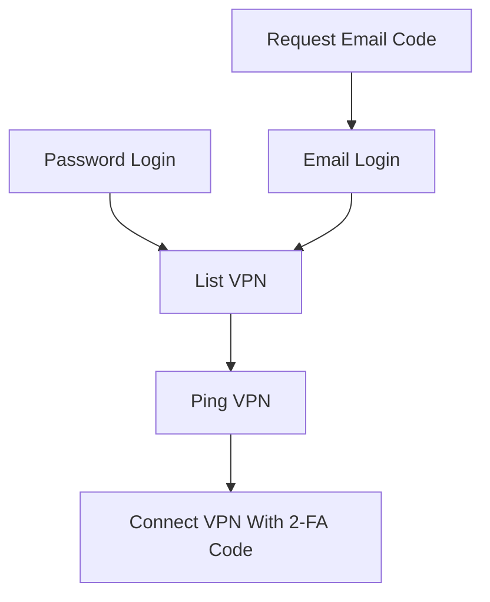

# corplink-rs

使用 rust 实现的 [飞连][1] 客户端

# 用法

```bash
# direct
corplink-rs config.json
# systemd
# config is /etc/corplink/config.json
systemctl start corplink-rs.service
# auto start
systemctl enable corplink-rs.service

# systemd with custom config
# config is /etc/corplink/test.json
# NOTE: cookies.json is reserved by cookie storage
systemctl start corplink-rs@test.service
```

# 配置文件实例

```json
{
  "username": "your_name",
  "password": "your_pass",
  "device_name": "device",
  "server": "your_server",
  // will generate corplink.conf
  "conf_name": "corplink",
  // will generate conf in /etc/wireguard
  "conf_dir": "/etc/wireguard"
}
```

# 原理和分析

[飞连][1] 是基于 [wg-go][2] 魔改的企业级 VPN 产品

## 配置原理

魔改了配置的方式，加了鉴权

猜测是：
- 动态管理 peer
- 客户端通过验证后，使用 public key 来请求连接，然后服务端就将客户端的 key 加到 peer 库里，然后将配置返回给客户端，等待客户端连接
    - wg 是支持同一个接口上连多个 peer ，所以这样是 OK 的
- 定时将不活跃的客户端清理，释放分配的 IP
- ...

因此，我们只需要生成 wg 的 key ，然后去找服务端拿配置，然后写到 wg 配置里，启动 wg ，就能连上服务端了

## 请求流程


### Linux



### Android



## otp 实现

飞连的 otp 是使用的标准的 [totp][1] ，在 ua 为 Android 时，会在登录时返回 totp 的 token ，然后使用 totp 算法就能生成出当前时间的验证码了，然后在获取连接信息时传输该验证码，就不需要单独验证验证码了

# TODO

- [x] 自动使用从服务器返回的请求中的时间戳同步时间
- [x] 自动生成 wg key
- [ ] 修复服务端异常断开连接后客户端不会退出的问题

# Changelog

- 0.1.2
  - support time correction for totp
- 0.1.1
  - support generate wg key
- 0.1.0
  - first version

# 参考链接

- [wg-go][2]
- [totp][3]
- [python 版本][4]

# License

```license
 Copyright (C) 2022  PinkD

    This program is free software; you can redistribute it and/or
    modify it under the terms of the GNU General Public License
    as published by the Free Software Foundation; either version 2
    of the License, or (at your option) any later version.

    This program is distributed in the hope that it will be useful,
    but WITHOUT ANY WARRANTY; without even the implied warranty of
    MERCHANTABILITY or FITNESS FOR A PARTICULAR PURPOSE.  See the
    GNU General Public License for more details.

    You should have received a copy of the GNU General Public License
    along with this program; if not, write to the Free Software
    Foundation, Inc., 51 Franklin Street, Fifth Floor, Boston, MA  02110-1301, USA.
```


[1]: https://www.volcengine.com/product/vecorplink
[2]: https://github.com/WireGuard/wireguard-go
[3]: https://en.wikipedia.org/wiki/Time-based_one-time_password
[4]: https://github.com/PinkD/corplink
